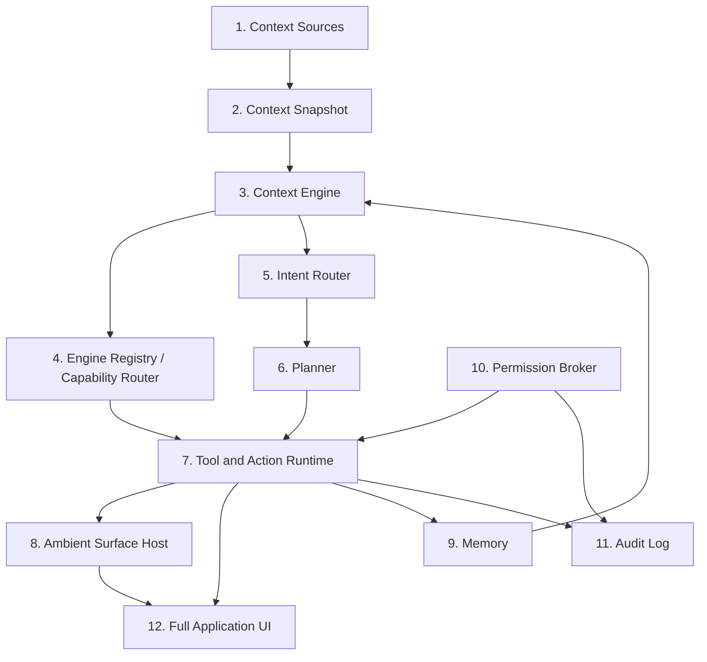

# Arquitectura de capacidades de Sakura

> Diseño D3.2. Describe las capas conceptuales que ordenan el roadmap
> (`docs/roadmap/SAKURA_TECHNOLOGY_ROADMAP.md`), no una reescritura del código actual. Cada capa
> indica explícitamente qué parte ya existe hoy en `release/kohana-1.0-rc` y qué parte es diseño
> para fases futuras. No confundir con `docs/architecture/HARDWARE_CAPABILITY_PROFILE.md` ni
> `docs/architecture/ADAPTIVE_ENGINE_REGISTRY.md`, que documentan implementación real ya existente
> a nivel de código — este documento es el mapa de más alto nivel que las conecta con el resto del
> roadmap.

## Las 12 capas

| # | Capa | Estado hoy |
|---|---|---|
| 1 | Context Sources | Parcial — ver detalle abajo |
| 2 | Context Snapshot | Parcial (`HardwareCapabilitySnapshot`, `SystemSnapshot`); Context Snapshot ambiental es Fase 1 |
| 3 | Context Engine | Planeado |
| 4 | Engine Registry / Capability Router | Implementado (alcance actual), evolución a Capability Router completo es planeada |
| 5 | Intent Router | Parcial — el enrutamiento de `Command Center` cubre comandos explícitos, no intención en lenguaje libre |
| 6 | Planner | Planeado |
| 7 | Tool and Action Runtime | Parcial — acciones internas de Sakura existen (`AutomationAction`, `IAutomationActionExecutor`); acciones externas son Fase 5/7 |
| 8 | Ambient Surface Host | Planeado (Fase 1) |
| 9 | Memory | Planeado (Fase 6) |
| 10 | Permission Broker | Planeado (primitivas en Fase 1, completo en Fase 7) |
| 11 | Audit Log | Parcial (logs por subsistema hoy: `command-center.log`, `voice-capture.log`, etc.); auditoría unificada es planeada |
| 12 | Full Application UI | Implementado (Sakura Shell) |

## 1. Context Sources

Fuentes de información que Sakura puede leer, cada una bajo su propio permiso:

- Ventana activa (planeado, Fase 2).
- UI Automation (planeado, Fase 2/7).
- Captura de pantalla — base ya existe (`IScreenCaptureService`, usado hoy por la sección Captura
  de la Shell); análisis automático sobre esa captura es Fase 2.
- OCR (planeado, Fase 2).
- Micrófono — implementado (`IVoiceInputService`/Whisper, `IWakeWordService`/Vosk).
- Audio del sistema — implementado (`IAudioMixerService`).
- Texto seleccionado (planeado, Fase 3).
- Portapapeles (planeado, Fase 3).
- Archivos de un workspace autorizado (planeado, Fase 5).
- Procesos (planeado, Fase 4/7).
- Hardware — implementado (`IHardwareCapabilityService`).
- Eventos del sistema (reanudación, cambio de energía) — implementado parcialmente
  (`HandleSystemResume`, integración con bandeja/energía existente).
- Workspace de proyecto (planeado, Fase 5).

## 2. Context Snapshot

Hoy Sakura ya tiene dos fotografías independientes y deliberadamente separadas (ver
`HARDWARE_CAPABILITY_PROFILE.md`): `SystemSnapshot` (uso instantáneo) y `HardwareCapabilitySnapshot`
(identidad de hardware, estable). Un "Context Snapshot" ambiental — de la ventana activa o de una
solicitud puntual — es una capa nueva planeada para la Fase 1, con la misma filosofía: datos que se
capturan una vez por solicitud, no un flujo continuo de vigilancia.

## 3. Context Engine

Capa planeada que combinaría varias Context Sources en un contexto coherente para una solicitud
(p. ej. "esto ve la pantalla + esto se dijo por voz + esto es el hardware disponible"). No existe
hoy — el Command Center actual resuelve comandos sin necesitar este nivel de fusión de contexto.

## 4. Engine Registry / Capability Router

**Esta es la capa más madura del sistema hoy.** `IAdaptiveEngineRegistry` (ver
`ADAPTIVE_ENGINE_REGISTRY.md`) ya cataloga los motores reales de Sakura (Whisper, Vosk, SAPI, y los
proveedores de IA — OpenAI, Ollama, LM Studio, compatible) y expone su estado observable
(disponible/configurado/activo) para que `AdaptiveEnginePolicy` produzca recomendaciones según el
`HardwareCapabilityProfile`.

La evolución a "Capability Router" completo (Sección 11 del encargo D3.2) significa que ese mismo
registro empiece a decidir, no solo a informar: elegir LLM, VLM, STT, TTS, OCR, embeddings,
clasificador o herramienta según hardware, tarea, privacidad, batería, temperatura, carga y
preferencias del usuario, y decidir si la ejecución es local, híbrida o en la nube. Hoy la decisión
de motor de IA la fija el usuario en Personalización; el enrutamiento automático por tarea/contexto
es trabajo planeado, no implementado.

## 5. Intent Router

Command Center ya enruta **comandos explícitos** (el usuario escribe o navega hasta una acción
conocida) a través de su registro de comandos. Un Intent Router que interprete lenguaje libre y lo
traduzca a una o más acciones — más allá de coincidencia de texto — es trabajo planeado, ligado a
Fases 2 en adelante.

## 6. Planner

Capa planeada: para solicitudes que requieren más de una acción encadenada (p. ej. Project
Companion, Fase 5), algo debe decidir el orden y las dependencias antes de ejecutar. No existe hoy
porque ninguna capacidad implementada todavía requiere planificación multi-paso.

## 7. Tool and Action Runtime

`Nexo.Core.Automation` (`AutomationAction`, `AutomationActionResult`, `AutomationActionType`,
`AutomationPermissionPolicy`, `AutomationRiskLevel`) y su ejecutor en `Nexo.App.Automation`
(`NexoAutomationActionExecutor`) ya existen como el runtime de acciones **internas** de Sakura
(navegar, cambiar preferencias, disparar comandos). El runtime debe poder, según la visión final:

- escribir, abrir, navegar, cambiar configuraciones (parcial, dentro de Sakura);
- editar proyectos, ejecutar comandos de terminal, trabajar con Git (planeado, Fase 5);
- controlar audio (implementado, `IAudioMixerService`);
- hacer UI Automation, usar MCP y Windows App Actions (planeado, Fase 7);
- registrar y revertir acciones (parcial — el registro existe por subsistema; la reversión
  genérica es planeada, ligada a los snapshots de la Fase 4).

## 8. Ambient Surface Host

Planeado en su totalidad (Fase 1 / D4): el host de ventanas no activables (Sakura Pills) que
renderiza resultados sin robar foco. No existe hoy — la Shell actual siempre requiere foco.

## 9. Memory

Planeado (Fase 6), con controles de retención y exclusión como requisito previo a cualquier
almacenamiento, según el principio de la Sección 5 de la visión de producto.

## 10. Permission Broker

Hoy los permisos son implícitos y por preferencia individual (p. ej. `WakeWordEnabled`,
`VisionEnabled`, `ShareSystemMetricsWithAi`). Un Permission Broker centralizado — que evalúe
permisos por aplicación y por capacidad de forma unificada, con exclusiones y confirmaciones
consistentes — es trabajo planeado, con primitivas iniciales en la Fase 1 y el modelo completo en
la Fase 7. Ver `docs/security/SAKURA_TRUST_AND_AUTONOMY_MODEL.md`.

## 11. Audit Log

Sakura ya escribe logs por subsistema bajo `NexoDataPaths.LogsDirectory`
(`command-center.log`, `voice-capture.log`, `wake-word-recognition.log`,
`ollama-runtime.log`, `resource-governor.log`, y desde Diseño D3.2, `data-root.log` cuando hay un
perfil de validación activo). Son diagnóstico técnico, no un registro de auditoría orientado al
usuario (quién hizo qué, cuándo, y cómo revertirlo). Un Audit Log unificado y visible para el
usuario es trabajo planeado, ligado a la Fase 1 en adelante.

## 12. Full Application UI

Implementado: Sakura Shell (Diseño D1–D1.1), Command Center (Diseño D2), Daily Flow y Focus
Continuity (Diseño D3–D3.1), perfiles de validación aislados (Diseño D3.2). Es la capa más completa
del sistema y el centro de control descrito en la visión de producto.

## Action Runtime — capacidades objetivo

Como referencia para las fases 4, 5 y 7, el runtime de acciones completo (hoy solo parcialmente
implementado, ver capa 7) debe eventualmente poder:

- escribir; abrir; navegar; cambiar configuraciones; editar proyectos; ejecutar comandos;
  controlar audio; trabajar con archivos; hacer UI Automation; usar MCP y App Actions; registrar y
  revertir acciones.

Ninguna de estas capacidades fuera de "controlar audio", "navegar" y "cambiar configuraciones
(dentro de Sakura)" está implementada a la fecha de este documento.
